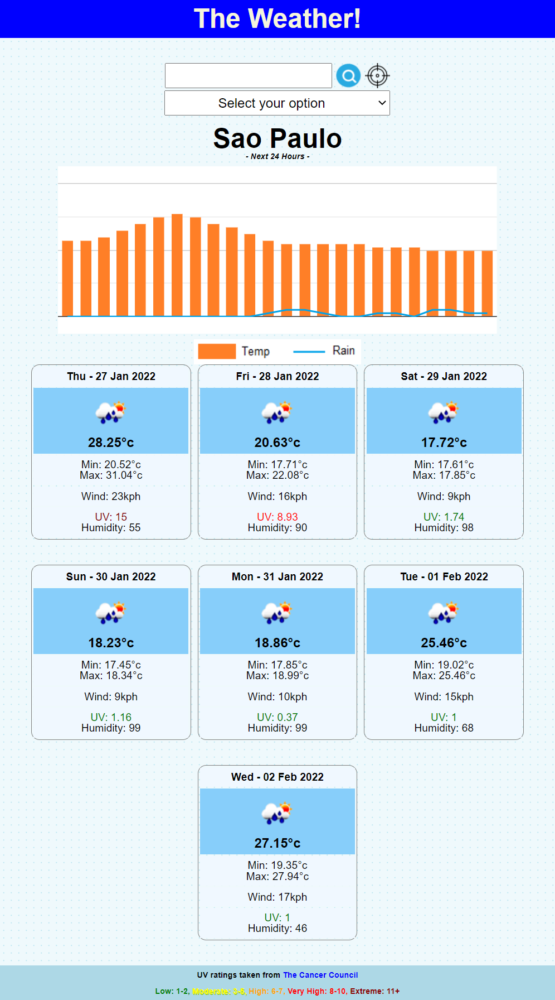

## The Weather - Steve Barry

##  The Task

The task was to create a solution that provides the current and future weather for a city, or cities, that the user inputs, and retains a history of searches.

### ⭐ ⭐ S.T.A.R. ⭐ ⭐

**SITUATION**

The provided user story was: 

> AS A traveler
> 
> I WANT to see the weather outlook for multiple cities
>
> SO THAT I can plan a trip accordingly

**TASK**

Provide a solution that allows a user to enter a city name, and provide them with the current weather and a forecast for the next 5 days. It will also retain a search history that can be clicked to 'quick view' the weather and forecast again.

**ACTION**

Writing of a solution to resolve the situation, including:
* Layout
  * *Layout is responsive and functional on various screen sizes*
  * *Simple, yet attractive design*
  * *Logical layout*
  * *Improved code visualisation - eg: indentation*
  * *Error free loading*
  * *Favicon designed and added*
  * *Thorough comments*
  * *Intuitive design with messages to users*
* Javascript
  * *Error free performance*
  * *Multiple functions to separate aspects of code*
  * *Thorough comments*
* GIT
  * *Numerous commits to track changes in code*
  * *Code added to public repository and Github Pages for public viewing*
* Functionality
  * *Feedback to the user as to how well they've done, with a Star Wars twist*
  * *Hall of Fame to track the best scores, which can be cleared if desired*

**RESULT**

The end code is stored on Github, and publicly available and viewable. This result meets all requirements of the User Story and acceptance criteria:

* GIVEN a weather dashboard with form inputs
* WHEN I search for a city
* THEN I am presented with current and future conditions for that city and that city is added to the search history
* WHEN I view current weather conditions for that city
* THEN I am presented with the city name, the date, an icon representation of weather conditions, the temperature, the humidity, the wind speed, and the UV index
* WHEN I view the UV index
* THEN I am presented with a color that indicates whether the conditions are favorable, moderate, or severe
* WHEN I view future weather conditions for that city
* THEN I am presented with a 5-day forecast that displays the date, an icon representation of weather conditions, the temperature, the wind speed, and the humidity
* WHEN I click on a city in the search history
* THEN I am again presented with current and future conditions for that city

##  The Outcome

As the acceptance criteria has been met and exceeded, the task is now complete. 

*As a caveat, I checked with the teachers to confirm if the topic of questions had to be Javascript related, and they confirmed it did not.*
> There is a new Google feature named FLoc that is generating the below error. This is not a result of the performance or design of the site.
> 
> 
> 
> [Google FLoC](https://techcrunch.com/2021/03/30/google-starts-trialling-its-floc-cookie-alternative-in-chrome/)

You can view the finished product [HERE](https://nbs5000.github.io/quizTime/)

Alternatively, here is a screenshot:

> 

---

Written by Steve Barry - Due date 23/12/2021

© 2021 Trilogy Education Services, LLC, a 2U, Inc. brand. Confidential and Proprietary. All Rights Reserved.

